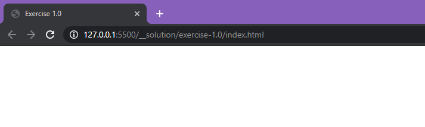
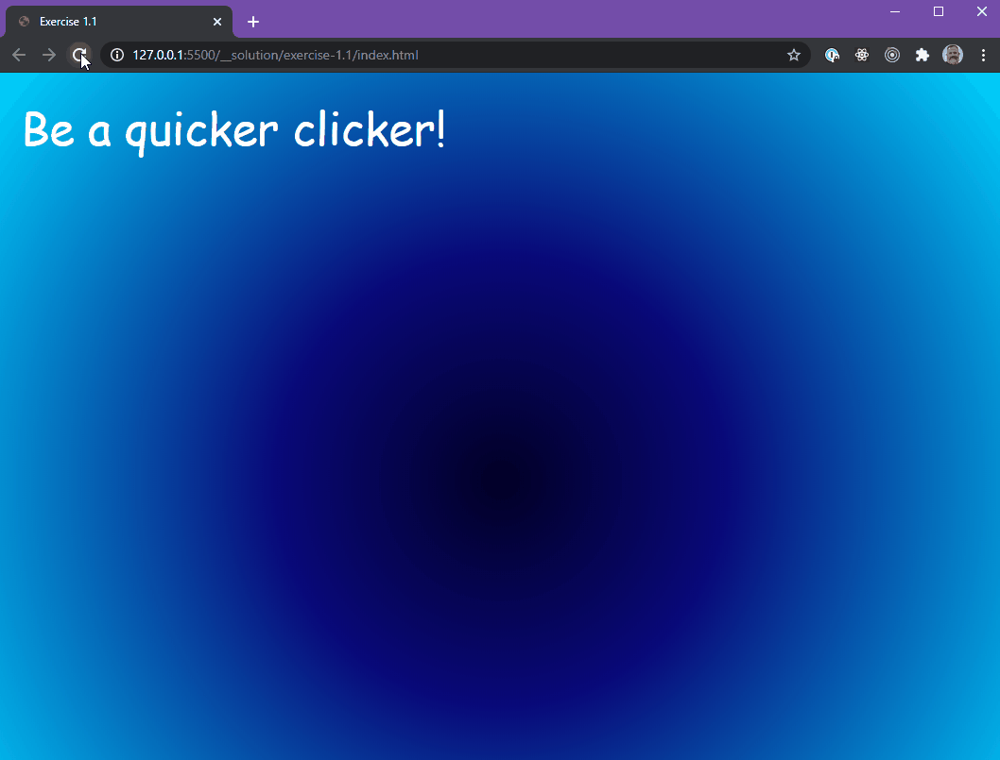
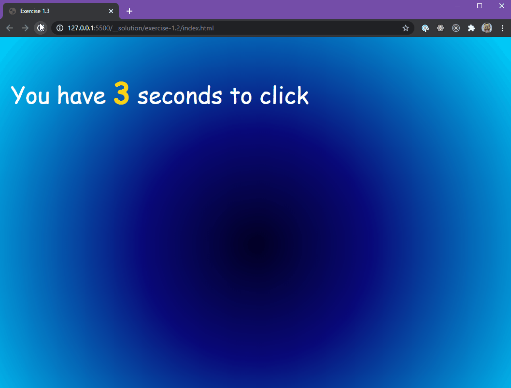
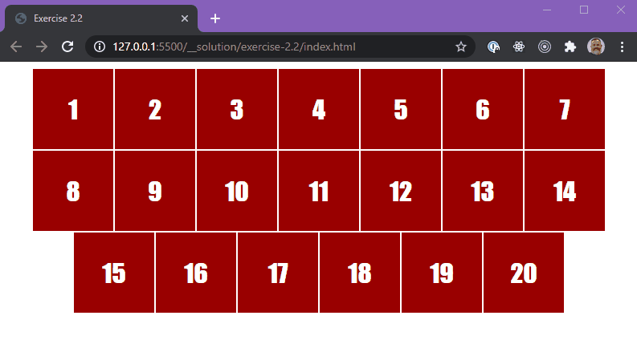
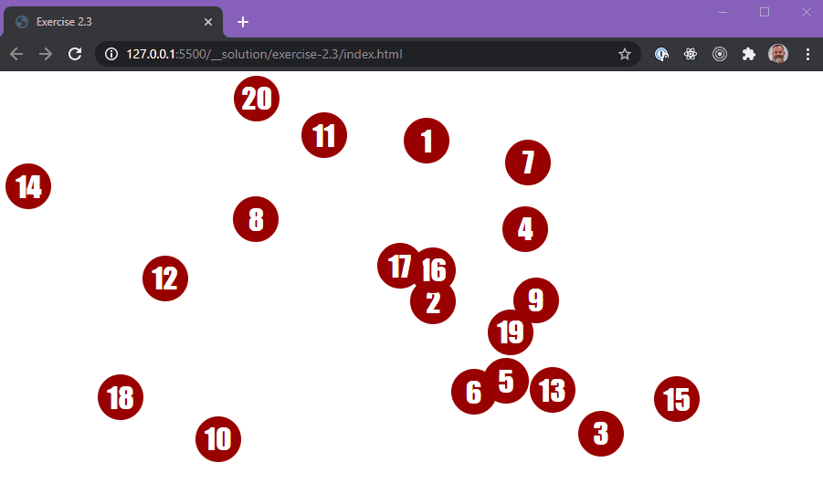
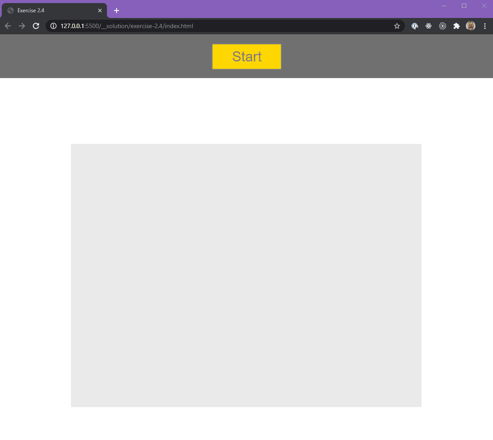

# JavaScript - Events

## Setup

---

## Exercise 1.0 - Warm up



Write an app that registers a click anywhere on the screen.
Once the user clicks, add some text to the page.

Hints:

- Target the `<body>`
- By default, the `<body>` will be 0px tall. Add this into the `head` of the `index.html` file.

```html
<style>
  * {
    margin: 0;
    padding: 0;
  }
  body {
    width: 100vw;
    height: 100vh;
  }
</style>
```

## Exercise 1.1 - Warmer



_no copy/pasting_

Write an app that gives the user 1s (or 1000ms) to click anywhere on the screen.

If they click within the required time, you should tell them that they've won,
else let them know that they've lost.

Hints:

- Target the `<body>`
- `setTimout` is your friend.
- You'll need a flag (variable containing a boolean) to keep track of whether the user has won or lost.

## Exercise 1.2 - Counting down!



_no copy/pasting_

Similar to the last exercise, write an app that gives the user
a random amount of time (up to 5 seconds) to click anywhere on the screen.

But this time, let's let the user know how much time they have to actually 'click'.

If they click within the required time, you should tell them that they've won,
else let them know that they've lost.

In short, replicate (and I do mean, REWRITE it from scratch) the last exercise, and add

- random amount of time to click
- tell the user how much time they have to click.

**Challenge:** Make the countdown live (update on the screen)...

---

## Exercise 2.1 - Buttons!!


Write an app that generates 20 red buttons.

When the user clicks a button it should become green.

## Exercise 2.2 - Red to Green to Red again.



Building on exercise 2.1, write a program that places 20 red buttons on the page. When clicked, buttons should turn green, but this time clicking on a green button should turn it back to red.

I strongly recommend redoing the JS from scratch without looking at your previous answer as mush as possible.

## Exercise 2.3 - Buttons Here, Buttons There, Buttons Everywhere!



Building on exercise 2.1 and 2.2, write a program that places 20 buttons in the page that toggle from red to green but this time they are located in random positions on the screen.

### HINT

- You can use `position: absolute`, `top`, and `left` to control where the buttons are located.
- You can use inline styles (eg. `node.style.position = 'absolute'`)

I strongly recommend redoing the JS from scratch without looking at your previous answer as mush as possible.

---

<center>🟡 - Minimally complete workshop (75%) - 🟡</center>

---

## Exercise 2.4 - Is This All just a Game to You?!



Building on all of the exercises done so far, write a program that

- on load, there is only a 'Start' button
- clicking on the start button
  - deletes the button
  - creates a random number of buttons on the screen.
- These buttons need to all be clicked within a given amount of time.

If the user is successful, show a congratulatory message! They've won the game!!

### Note

- Once the user clicks all of the buttons, the game ends.
- Once the game ends, the buttons no longer change change color (remove the event listeners).

### B-E-A-U-TIFUL

Don't forget to take some time to make it pretty.

---

<center>🟢 - Complete workshop (100%) - 🟢</center>

---

## Exercise 3 - A Clock

Create a page that displays the current time

### HINT

- https://www.w3schools.com/js/js_dates.asp
- https://www.digitalocean.com/community/tutorials/understanding-date-and-time-in-javascript

## Exercise 3.2 - A Stopwatch

Create a page that contains a start/stop button which starts/stops a stopwatch that displays seconds.

### HINT

- `setInterval()` and `clearInterval()`

### Bonus

Make it more like an actual stopwatch where it counts the seconds and the minutes (`00:00`).
